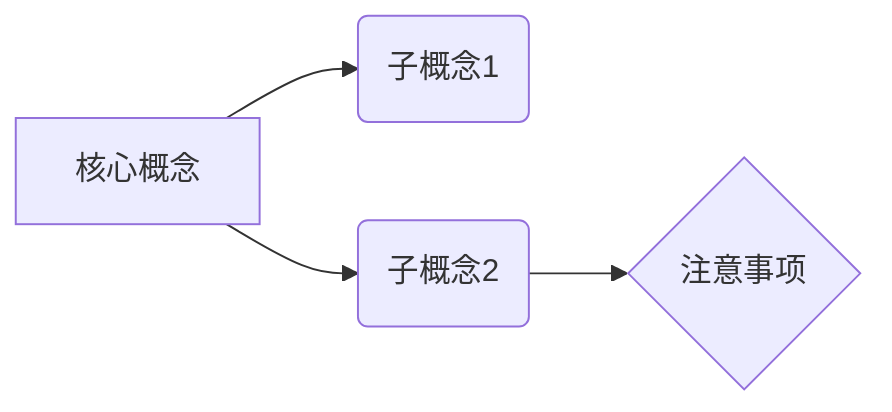

## 本章概览

**Why This Matters**: 简要说明为什么这章的知识对 C++ 开发者至关重要。比如：“指针是 C++ 的灵魂，不理解指针就无法进行系统级编程。”

**核心目标**：

- 目标 1
- 目标 2
- 目标 3

---

## 1. 基础知识讲解 (Core Concepts)

这里讲解本章最核心、最基础的概念。适合初学者快速入门。

### 1.1 概念 A

代码示例 + 解释。

### 1.2 概念 B

代码示例 + 解释。

---

## 2. 进阶应用 (Modern C++ Practice)

这里主要对比 C++98 与现代 C++ (C++11/14/17/20) 的区别，或者介绍高级用法。

- **传统写法**：`int *p = NULL;`
- **现代写法**：`int *p = nullptr;` (C++11)
- **更优解**：`auto p = std::make_unique<int>();` (C++14)

---

## 3. 工程应用中的潜在风险 (Engineering Pitfalls)

🚨 **高危警示**：列出实际开发中容易踩的坑。

### 3.1 风险点 A

**现象**：程序崩溃 / 内存泄漏 / 逻辑错误。
**原因**：...
**解决方案**：...

### 3.2 风险点 B

...

---

## 4. 总结与回顾 (Summary & Review)

### 核心知识图谱

### 记忆要点

1. 要点 1
2. 要点 2

> **下一章预告**：第 X+1 章将介绍...
